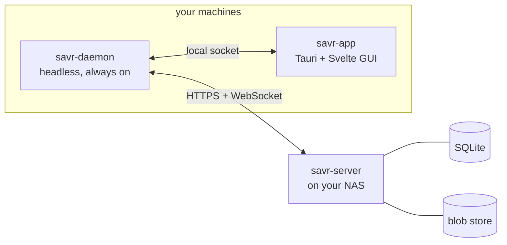

<h1 align="center">Savrr</h1>

<p align="center">
  
</p>

<p align="center"><b>Self-hosted save sync for every game you play, not just the Steam ones.</b></p>

Steam Cloud is great, right up until you play something that isn't on Steam. GOG, Epic, itch, emulators, that DRM-free copy you bought years ago: none of it syncs. If you game on a desktop, a laptop, and a Steam Deck, you either copy save folders around by hand or lose progress.

Savrr fixes that for saves you control, on hardware you control. It notices when a game starts and stops, backs the saves up to your own server, and pushes them to your other machines. No account with anyone, no cloud you don't own.

> **Status: early.** The core, server, daemon, and desktop app are being built out milestone by milestone. It is not ready to trust with your only copy of a save yet. Watch the releases if you want to know when it is.

## How it works

Four Rust pieces share one type-checked core, so the wire format can't drift between them.



- **`savr-daemon`** watches your processes. When a known game exits, it snapshots the save files, packs only what changed, and uploads it. It idles at a few megabytes of RAM with almost no CPU when nothing is running.
- **`savr-app`** is the window you open when you want to add a game, register a folder to watch, resolve a conflict, or restore an old save. The rest of the time it isn't running.
- **`savr-server`** is the source of truth: a small Axum service you run in Docker on a home server. It keeps an immutable, deduplicated history of every save and pushes new versions to your other devices in real time.
- **`savr-core`** holds the shared types, the manifest parser, the hashing, and the sync protocol.

Backups are additive. The server never overwrites history, so a restore is always undoable and ransomware can't erase your old saves. When two machines back up a game from the same starting point, Savrr treats it like a branch in Git: nothing is thrown away, and you pick the winner.

Save locations come from the [Ludusavi manifest](https://github.com/mtkennerly/ludusavi-manifest), a community database of where thousands of games keep their saves. You can also point Savrr at a folder yourself for anything the manifest doesn't cover.

## Running the server

You need Docker and a machine that stays on (a NAS, a home server, a spare box).

```bash
cd docker
echo "SAVR_OWNER_PASSWORD=pick-something-long" > .env
docker compose up -d
```

That runs SQLite plus filesystem blob storage in a single container with one volume. It fits comfortably on a Raspberry Pi. For Postgres or S3/MinIO instead, see the profiles in `docker/`.

Put it behind TLS before you expose it. The simplest path for a home setup is [Tailscale](https://tailscale.com/) or WireGuard, so your devices reach the server over an encrypted mesh and you never open a port. A reverse proxy with a real certificate works too. Details are in [docs/prd/PRD-06](docs/prd/PRD-06-Security-Auth.md).

## Installing the desktop pieces

Grab the installer for your OS from the [latest release](https://github.com/sebandroidev/savrr/releases/latest). The daemon is bundled inside the app, so there's nothing separate to install — the app starts it for you, lives in the system tray, and keeps syncing in the background when you close the window. It walks you through pairing with your server on first run, and updates itself through GitHub releases after that.

## Building from source

You need Rust (stable), Node 22+, and pnpm.

The desktop app embeds two things at compile time: the built frontend, and the daemon binary it ships as a bundled sidecar. Both have to exist before `savr-app` will build, so on a fresh clone the order matters:

```bash
# 1. build the frontend the app embeds
pnpm --dir crates/savr-app/ui install
pnpm --dir crates/savr-app/ui build

# 2. build + stage the daemon the app bundles (into src-tauri/binaries/)
scripts/stage-sidecar.sh

# 3. now the workspace compiles and tests
cargo build --workspace
cargo test --workspace

# and the desktop bundle
cargo tauri build --config crates/savr-app/src-tauri/tauri.conf.json
```

## Repo layout

```
crates/
  savr-core/     shared types, manifest parsing, hashing, .savr archives, protocol
  savr-server/   Axum service: versioned history, blob store, push
  savr-daemon/   headless detect + backup + sync
  savr-app/      Tauri v2 desktop app (Svelte UI under ui/)
docker/          server image + compose
docs/prd/        the product requirement docs this was built from
```

## Prior art

Savrr stands on [Ludusavi](https://github.com/mtkennerly/ludusavi) by Matthew Kennerly, an excellent cross-platform, cross-store backup tool. We reuse its manifest and borrow its differential-backup and conflict ideas. What Savrr adds on top is the always-on daemon that catches game start and stop without a launcher, the self-hosted server, and live sync between devices. If you just want manual backups, use Ludusavi. It's more mature and it's great.

## License

MIT. See [LICENSE](LICENSE). Contributions are welcome, start with [CONTRIBUTING.md](CONTRIBUTING.md).
