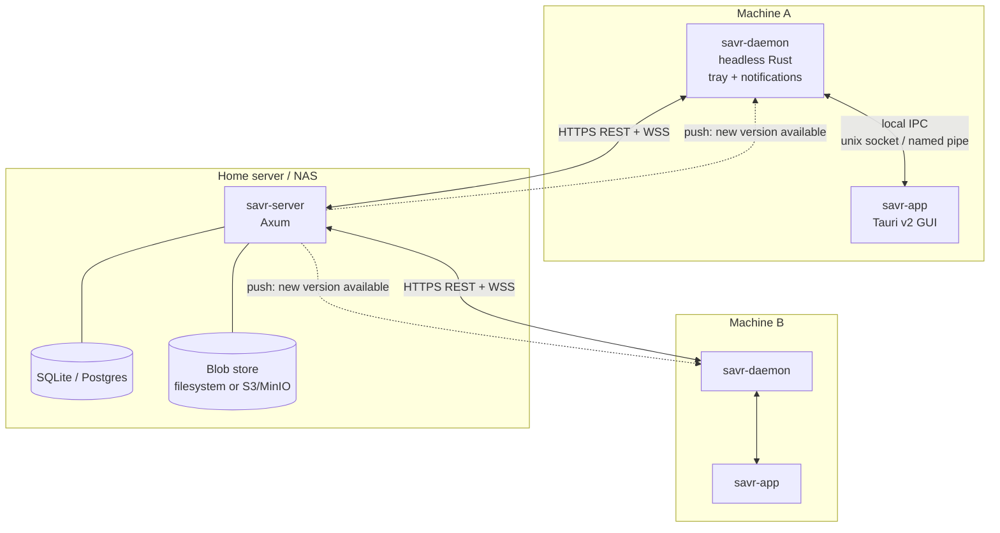

# PRD-01 · System Architecture

## 1. Component map



## 2. Why three binaries (not one)

The requirement "always-on, tiny RAM" and the requirement "GUI to manage games" pull in opposite directions. A webview app idling in the tray still holds tens of MB. So we split:

| Binary | Runtime | Lifetime | Job |
|---|---|---|---|
| `savr-daemon` | pure Rust, no webview | always on (system service) | detect, backup, sync, tray, notifications |
| `savr-app` | Tauri v2 (Rust + OS webview) | on demand | manage games/roots, resolve conflicts, browse/restore |
| `savr-server` | Axum (Rust) | always on (Docker) | versioned history, dedup blob store, push |

The **daemon owns the tray icon and OS notifications** (via `tray-icon` + `notify-rust`), because that is the piece that is always running. "Open Savr" in the tray menu launches `savr-app`. The GUI talks to the daemon over local IPC (Unix domain socket on Linux/macOS, named pipe on Windows) – never directly to the server for detection/backup state.

> **Fallback if you want to ship faster:** a single Tauri app running in tray-only mode (window hidden) can do everything. You trade ~40–80 MB idle RAM for one less binary and no IPC layer. Recommend the split for v1 given G5, but this is a clean cut line if the timeline tightens.

## 3. Shared crate: `savr-core`

The heart of the "shared types" win from choosing Rust everywhere. A single crate compiled into daemon, GUI (via Tauri commands), and server.

Contains:
- All DTOs / wire types (`serde`) – see PRD-05.
- Manifest parsing + path placeholder resolution (PRD-02).
- Snapshot hashing + diff (PRD-03).
- The sync protocol state machine.
- Error types.

Result: change a struct once, the compiler enforces it across all three tiers. No drift, no hand-written client SDK.

## 4. Tech stack

### Desktop (`savr-daemon` + `savr-app`)
| Concern | Choice | Note |
|---|---|---|
| Language | Rust (stable) | one language, shared crate |
| Async runtime | Tokio | shared with server |
| Process watching | `sysinfo` | cross-platform process/exe enumeration |
| File watching (optional) | `notify` | debounced save-dir change hints |
| Hashing | `blake3` | very fast, tree-hash friendly |
| Compression | `zstd` | fast, good ratio, tunable level |
| Tray | `tray-icon` | same crate Tauri uses; Linux click-only (no hover events) |
| Notifications | `notify-rust` | native toasts on all three OSes |
| GUI | **Tauri v2** | stable, tiny binary, OS webview, Rust core |
| GUI frontend | your choice of web stack (React/Svelte/Solid) | Tauri is frontend-agnostic |
| Local IPC | `interprocess` crate | unix socket / named pipe abstraction |
| HTTP client | `reqwest` | REST to server |
| WebSocket client | `tokio-tungstenite` | push channel |

### Server (`savr-server`)
| Concern | Choice | Note |
|---|---|---|
| Framework | **Axum** | Tokio-native, minimal, fast; shares `savr-core` |
| DB | SQLite (`sqlx`) default; Postgres optional | SQLite = one less container on a NAS |
| Migrations | `sqlx migrate` | checked-in SQL |
| Blob store | filesystem volume default; S3/MinIO optional | content-addressed by blob hash |
| Auth | JWT (`jsonwebtoken`) | device tokens, see PRD-06 |
| WebSocket | `axum::extract::ws` | presence + push |
| Config | `figment` (env + TOML) | 12-factor friendly |

### Linux packaging note
Tauri tray on Linux needs `libayatana-appindicator` (preferred) or `libappindicator3`. Ship a `.deb`/AppImage that declares the dependency; document the Flatpak path separately.

## 5. Repo layout (Cargo workspace)

```
savr/
├── Cargo.toml                 # workspace
├── crates/
│   ├── savr-core/             # shared types, manifest, hashing, protocol
│   ├── savr-daemon/           # headless service: detect + sync + tray
│   ├── savr-app/              # Tauri v2 GUI (src-tauri here)
│   │   └── ui/                # web frontend
│   └── savr-server/           # Axum service
├── manifests/                 # cached ludusavi-manifest snapshots
├── migrations/                # SQL migrations for the server
├── docker/                    # server Dockerfile + compose
└── docs/                      # this PRD suite
```

## 6. End-to-end data flow (happy path)

1. Daemon polls processes every N seconds (`sysinfo`).
2. A known game exe appears → **GameStarted** event (debounced).
3. Game exe disappears → **GameStopped** → wait `settle_ms` (let the game flush its save) → trigger backup.
4. Backup: resolve save paths (manifest + manual) → build snapshot (file→blake3) → diff against last snapshot → if changed, package changed files into a zstd archive → compute archive hash.
5. Upload: POST version metadata + archive to `savr-server`. Server dedups blobs by hash, advances **head**, stores immutable version.
6. Server pushes **VersionAvailable** over WebSocket to the account's other online devices.
7. Other device's daemon receives push → notifies user ("New save for *Game X* – download?") → on accept (or auto, per policy) pulls the version and restores to local save path.
8. Conflicts (parent ≠ head) are flagged, not silently overwritten (PRD-03 §4).
